### Привет 👋

Пишу бэкенд так, чтобы ночью не будили: тесты, документированные API и внятные ответы на вопрос «почему эндпоинт работает именно так». Хороший бэкенд не падает, когда маркетинг запускает рекламу, и его можно поддерживать без археологических раскопок в коде.

**Сайт-резюме → [shtekxr.github.io](https://shtekxr.github.io/)**

---

### Стек

Ещё в обиходе: asyncio, Pydantic, Alembic, WebSockets, mypy, ruff, Swagger UI, микросервисная архитектура.

---

### Чем занимался

**Авито** · Python-разработчик в команде модерации · апр 2024 — июн 2025

- Система плагинов для рабочего окружения модераторов: архитектура, согласование с фронтом, деплой. Среднее время обработки кейса **−36 %** по внутренней метрике команды.
- Починил рвущийся стрим в проекте с нейросетями: Nginx по умолчанию рвал long-polling — настроил проксирование WebSockets, heartbeat-фреймы и graceful reconnect.
- Оптимизация PostgreSQL: частичные индексы, устранение N+1 через `selectinload`, кэш справочников в Redis. Критичные эндпоинты — с **~800 мс до 120 мс**.

**Иконика** · Backend-разработчик, аутсорс-студия · апр 2022 — фев 2024

- REST API на FastAPI с автогенерацией Swagger, миграции через Alembic — всегда с написанным `downgrade`.
- Микросервисный проект: 4 сервиса по REST, Docker Compose для локальной разработки, CI/CD на GitHub Actions.
- Кэширование в Redis и фоновые задачи на asyncio: среднее время ответа API — с **~400 мс до 60 мс**.

---

### Связаться

